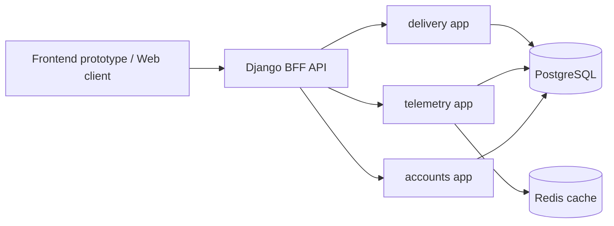
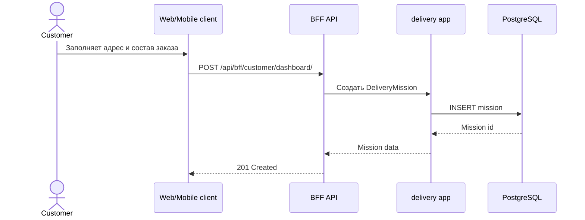
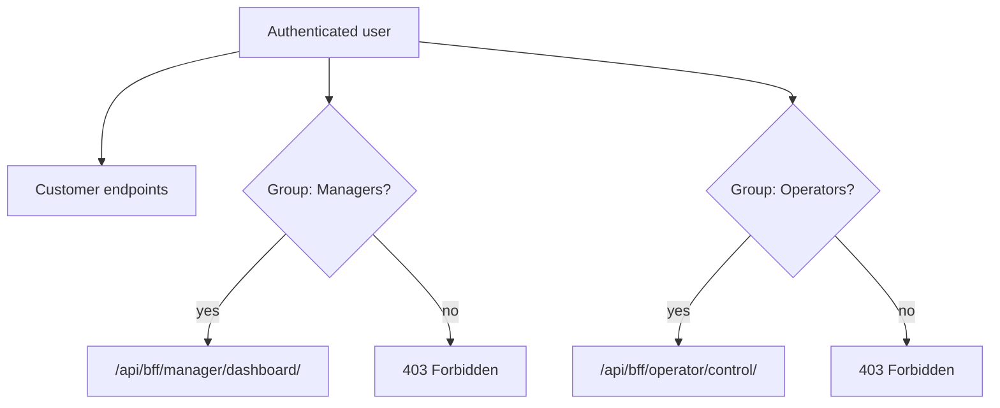
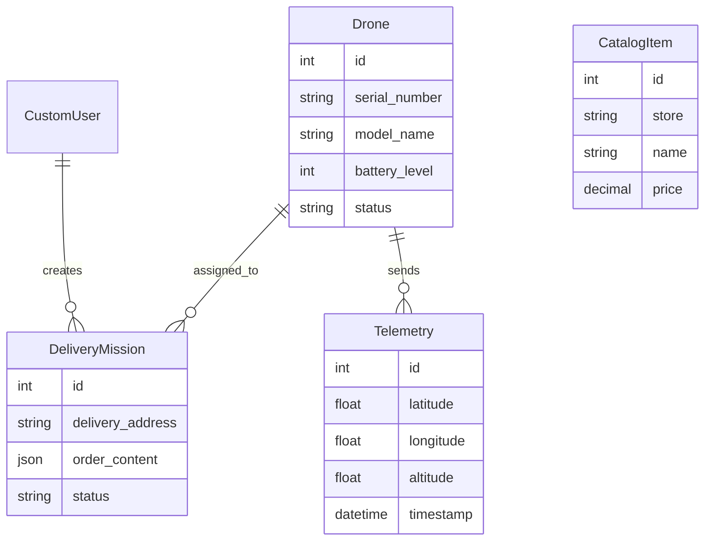

# Drone Delivery Platform

Django REST проект для сервиса доставки дронами. В проекте оставлен backend-only подход: Django отвечает за API, авторизацию, бизнес-логику, агрегированные BFF-эндпоинты, работу с PostgreSQL и Redis. HTML-шаблоны и серверный frontend удалены.

Основная категория пользователей по требованиям - внешний круг клиентов сервиса доставки еды. Клиенты создают заказы из каталога магазинов и ресторанов, а оператор и менеджер являются внутренними ролями компании для выполнения и контроля доставки.

## Подробная документация

- [Пояснительная записка и проверка требований](docs/PROJECT_REPORT.md)
- [Подробный деплой на облачный сервер через GitHub Actions](docs/DEPLOYMENT_GUIDE.md)
- [Проверка через Postman](docs/POSTMAN_GUIDE.md)
- [Диаграммы и как их построить](docs/DIAGRAMS.md)

## Что реализовано

- JWT-аутентификация через `djangorestframework-simplejwt`.
- CRUD API для дронов и миссий доставки.
- API телеметрии дронов и аварийная остановка дрона.
- Каталог товаров и поиск по магазину/названию.
- Клиентские заказы состоят из еды из каталога магазинов и ресторанов; BFF проверяет и нормализует позиции по `CatalogItem`.
- Backend for Frontend слой `/api/bff/`, который отдает данные в формате, удобном для внешнего web/mobile клиента.
- Статический frontend prototype в `frontend-prototype/` для демонстрации экранов и ручной проверки BFF.
- Docker Compose окружение: Django, PostgreSQL, Redis.
- GitHub Actions workflow: тесты, проверка миграций и деплой на облачный сервер по SSH.
- Postman collection для ручной проверки API.

## Архитектура Backend for Frontend

В проекте больше нет встроенного Django frontend. Вместо HTML-страниц используется отдельный BFF-слой в приложении `bff`.

Основная идея:

- `delivery` хранит доменную логику доставки: дроны, миссии, каталог.
- `telemetry` хранит и отдает координаты/высоту/состояние дронов.
- `accounts` хранит кастомную модель пользователя.
- `bff` агрегирует несколько доменных источников в ответы под конкретные клиентские сценарии.

BFF endpoints:

- `GET /api/bff/health/` - health check для мониторинга и деплоя.
- `GET /api/bff/customer/dashboard/` - профиль клиента, магазины, превью каталога, миссии клиента.
- `POST /api/bff/customer/dashboard/` - создание заказа клиентом.
- `GET /api/bff/manager/dashboard/` - управленческие метрики и список миссий. Доступ: группа `Managers` или superuser.
- `GET /api/bff/operator/control/` - новые миссии, готовые дроны, последняя телеметрия. Доступ: группа `Operators` или superuser.

Такой подход соответствует Backend for Frontend: внешний frontend не собирает экран из множества низкоуровневых запросов, а получает готовую структуру под конкретную страницу/сценарий.

## Frontend prototype

Для прототипирования пользовательского интерфейса добавлен отдельный статический клиент:

```text
frontend-prototype/
```

Это не Django templates и не серверный frontend. Прототип нужен для демонстрации экранов, проверки сценариев и подтверждения, что BFF отдает данные в удобном для клиента формате.

Запуск прототипа:

```bash
python3 -m http.server 5173 --directory frontend-prototype
```

Откройте:

```text
http://localhost:5173
```

Перед этим запустите backend:

```bash
docker compose up --build
docker compose exec web python scripts/populate_all.py
```

В прототипе доступны сценарии:

- вход по JWT;
- клиентская панель и создание заказа;
- панель менеджера;
- панель оператора;
- health check BFF API.

## Локальный запуск

```bash
docker compose up --build
```

После запуска примените тестовые данные:

```bash
docker compose exec web python scripts/populate_all.py
```

API будет доступен по адресу:

```text
http://localhost:8000
```

Проверка состояния:

```bash
curl http://localhost:8000/api/bff/health/
```

## Локальный запуск без Docker

```bash
python -m venv .venv
source .venv/bin/activate
pip install -r requirements.txt
python manage.py migrate
python scripts/populate_all.py
python manage.py runserver
```

Если `DB_HOST` не задан, Django использует SQLite. Для окружения, близкого к production, используйте Docker Compose с PostgreSQL и Redis.

## Проверка требований

- Выбрана категория проекта: доступ внешних пользователей сервиса доставки еды дронами.
- Клиент является основным пользователем системы; оператор и менеджер являются внутренними служебными ролями компании.
- Аутентификация реализована через JWT: `/api/token/`, `/api/token/refresh/`.
- Сущности доставки реализованы: `Drone`, `DeliveryMission`, `CatalogItem`.
- Телеметрия реализована через модель `Telemetry` и API `/api/telemetry/`.
- Роли менеджера и оператора реализованы через группы Django `Managers` и `Operators`.
- Лишний frontend удален: нет URL на HTML-дашборды, нет Django templates для пользовательского интерфейса.
- Frontend-прототип вынесен отдельно в `frontend-prototype/` и обращается к backend только через HTTP API.
- BFF реализован отдельным приложением `bff`, а не смешан с HTML-представлениями.
- Написаны API-тесты для JWT, миссий и BFF-эндпоинтов.
- Есть GitHub Actions workflow для тестов и деплоя.

## Основные API

Получить JWT:

```http
POST /api/token/
Content-Type: application/json

{
  "username": "manager_1",
  "password": "pass1234"
}
```

Создать заказ через BFF:

```http
POST /api/bff/customer/dashboard/
Authorization: Bearer <access_token>
Content-Type: application/json

{
  "delivery_address": "г. Москва, ул. Арбат, д. 10",
  "order_content": [
    {
      "store": "vkusvill",
      "name": "Бургер с говядиной",
      "quantity": 2
    }
  ]
}
```

Вместо пары `store` + `name` можно передать `item_id` из каталога. BFF проверит наличие еды в `CatalogItem` и сохранит заказ в нормализованном виде: `item_id`, `store`, `store_name`, `name`, `quantity`, `unit_price`, `line_total`.

Получить панель менеджера:

```http
GET /api/bff/manager/dashboard/
Authorization: Bearer <manager_access_token>
```

Получить панель оператора:

```http
GET /api/bff/operator/control/
Authorization: Bearer <operator_access_token>
```

## Проверка через Postman

1. Запустите проект: `docker compose up --build`.
2. Заполните базу: `docker compose exec web python scripts/populate_all.py`.
3. Откройте Postman.
4. Импортируйте файл `postman_collection.json`.
5. Создайте environment или используйте переменные коллекции:
   - `base_url` = `http://localhost:8000`
   - `access_token` = пустое значение, оно заполнится после запроса токена.
6. Выполните запрос `1. Get Token`.
7. Убедитесь, что в переменную `access_token` записался access token.
8. Выполните BFF-запросы:
   - `2. Customer Dashboard`
   - `3. Create Customer Order`
   - `4. Manager Dashboard`
   - `5. Operator Control`
9. Для manager/operator endpoints используйте пользователей из `scripts/populate_all.py`:
   - `manager_1 / pass1234`
   - `operator_1 / pass1234`
   - `client_1 / pass1234`

Ожидаемые статусы:

- `GET /api/bff/health/` возвращает `200`.
- `POST /api/token/` возвращает `200` и поля `access`, `refresh`.
- `GET /api/bff/customer/dashboard/` возвращает `200` для авторизованного клиента.
- `POST /api/bff/customer/dashboard/` возвращает `201`.
- `GET /api/bff/manager/dashboard/` возвращает `403` для обычного клиента и `200` для manager.
- `GET /api/bff/operator/control/` возвращает `403` для обычного клиента и `200` для operator.

## Деплой на облачный сервер через GitHub Actions

### 1. Подготовить сервер

Подойдет Ubuntu 22.04/24.04.

```bash
sudo apt update
sudo apt install -y git docker.io docker-compose-plugin
sudo usermod -aG docker $USER
newgrp docker
```

Склонируйте проект:

```bash
mkdir -p /opt/drone-platform
cd /opt/drone-platform
git clone <URL_ВАШЕГО_REPOSITORY> .
```

Создайте `.env` рядом с `docker-compose.yml`:

```env
SECRET_KEY=replace-me
DEBUG=False
ALLOWED_HOSTS=your-domain.com,SERVER_IP
DB_NAME=drone_db
DB_USER=drone_user
DB_PASSWORD=strong_password
DB_HOST=db
DB_PORT=5432
REDIS_URL=redis://redis:6379/0
```

Первый ручной запуск:

```bash
docker compose up -d --build
docker compose exec web python manage.py migrate
docker compose exec web python scripts/populate_all.py
docker compose exec web python manage.py collectstatic --noinput
```

### 2. Настроить GitHub Secrets

В GitHub откройте `Settings -> Secrets and variables -> Actions` и добавьте:

- `SERVER_HOST` - IP или домен сервера.
- `SERVER_USER` - пользователь на сервере, например `ubuntu`.
- `SERVER_SSH_KEY` - приватный SSH-ключ для подключения.
- `SERVER_SSH_PORT` - SSH порт, обычно `22`.
- `PROJECT_PATH` - путь к проекту на сервере, например `/opt/drone-platform`.

Публичный ключ должен быть в `~/.ssh/authorized_keys` на сервере.

### 3. Как работает workflow

Файл `.github/workflows/deploy.yml` делает следующее:

1. На каждый push в `main` поднимает PostgreSQL и Redis в GitHub Actions.
2. Устанавливает зависимости.
3. Проверяет миграции: `python manage.py makemigrations --check --dry-run`.
4. Запускает тесты: `python manage.py test`.
5. Если тесты прошли, подключается к серверу по SSH.
6. Обновляет код из `main`.
7. Пересобирает Docker Compose сервисы.
8. Применяет миграции, собирает static и повторно запускает тесты уже на сервере.

## Диаграммы для пояснительной записки

Диаграммы удобно построить в Mermaid, draw.io или PlantUML. Для отчета достаточно 3-4 диаграмм.

### 1. Диаграмма контейнеров

Показывает frontend prototype, BFF API, доменные Django-приложения, PostgreSQL и Redis.



### 2. Диаграмма последовательности создания заказа



### 3. Диаграмма ролей



### 4. ER-диаграмма



## Тесты

```bash
python manage.py test
```

Через Docker:

```bash
docker compose exec web python manage.py test
```
