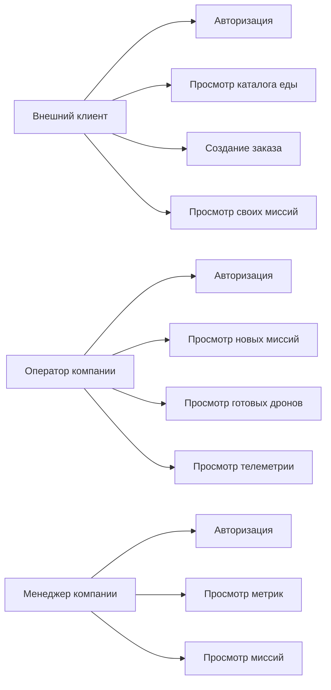
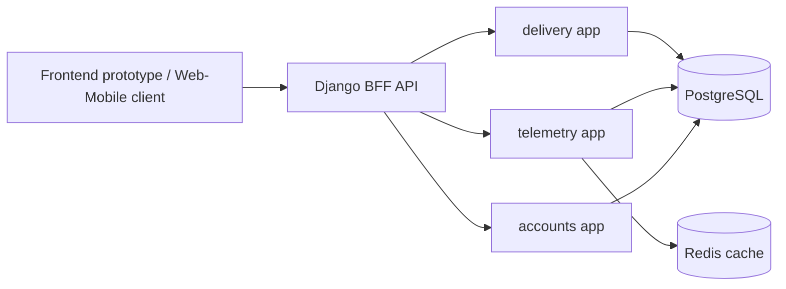
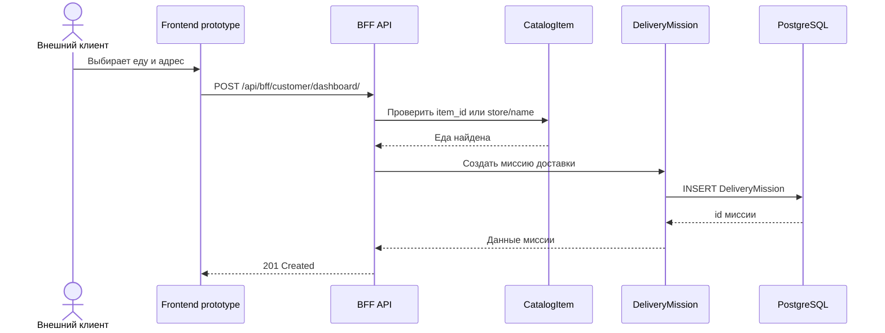
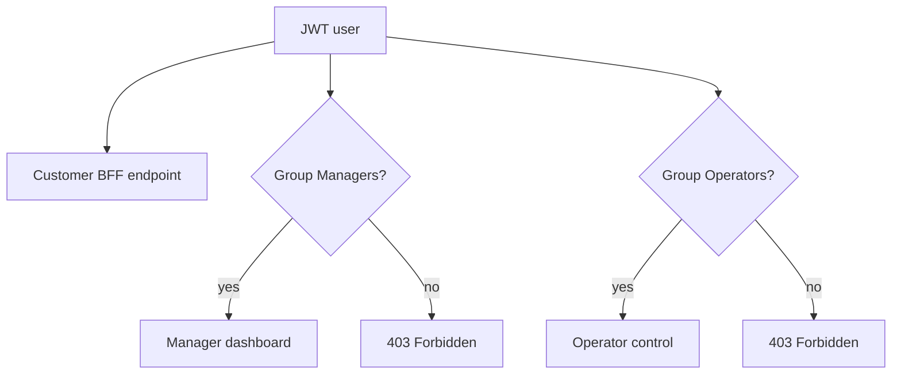
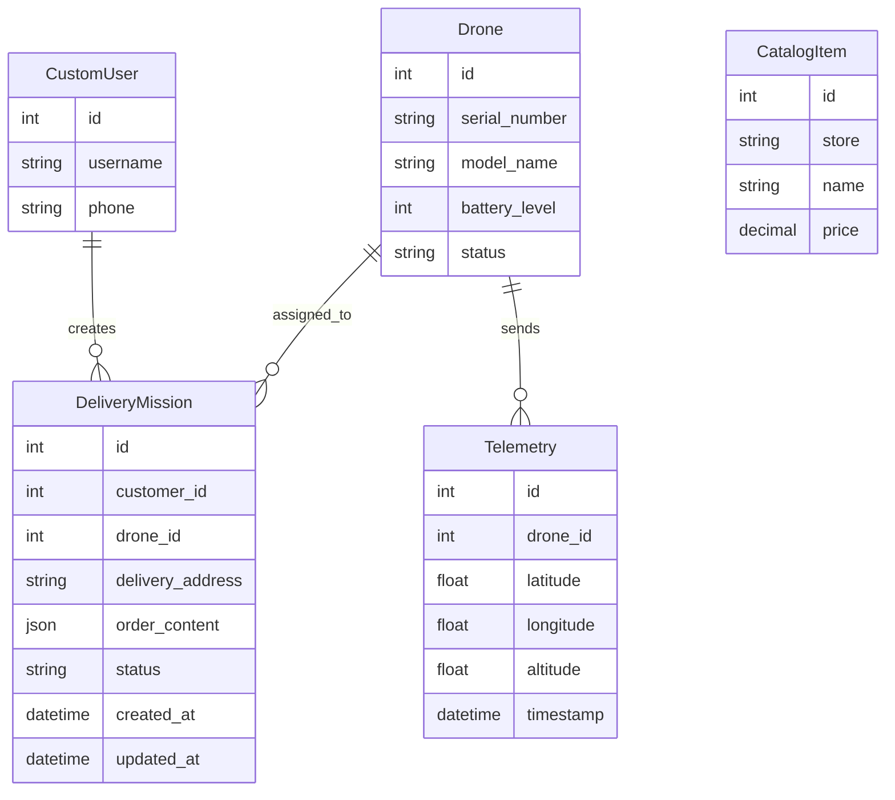

# Диаграммы для проекта

Диаграммы можно построить в Mermaid, draw.io, PlantUML или diagrams.net. Для пояснительной записки лучше использовать 4 диаграммы:

- диаграмма вариантов использования;
- контейнерная диаграмма;
- sequence diagram создания заказа;
- ER-диаграмма.

## 1. Диаграмма вариантов использования

Что показывает:

- внешний клиент создает заказ и смотрит миссии;
- оператор контролирует доставку;
- менеджер смотрит метрики.



Как объяснить:

```text
Главный актор системы - внешний клиент. Он использует сервис для заказа еды. Оператор и менеджер являются внутренними акторами компании и обеспечивают выполнение заказа.
```

## 2. Контейнерная диаграмма

Что показывает:

- frontend prototype;
- BFF;
- Django-приложения;
- PostgreSQL;
- Redis.



Как объяснить:

```text
Frontend не обращается напрямую к отдельным доменным приложениям. Он использует BFF API, который собирает данные под конкретный экран.
```

## 3. Sequence diagram создания заказа

Что показывает:

- клиент отправляет заказ;
- BFF проверяет каталог;
- создается миссия доставки.



Как объяснить:

```text
BFF не сохраняет произвольный заказ. Каждая позиция проверяется по каталогу еды, после чего заказ сохраняется в нормализованном виде.
```

## 4. Диаграмма ролей и доступа

Что показывает:

- клиент может работать только со своим dashboard;
- менеджер имеет доступ к manager dashboard;
- оператор имеет доступ к operator control.



Как объяснить:

```text
JWT подтверждает личность пользователя, а группы Django ограничивают доступ к внутренним функциям оператора и менеджера.
```

## 5. ER-диаграмма

Что показывает:

- пользователь создает миссии;
- дрон назначается на миссию;
- дрон отправляет телеметрию;
- каталог содержит еду.



Как объяснить:

```text
Связь DeliveryMission с CatalogItem реализована через JSON order_content, потому что заказ хранит снимок цены и названия еды на момент оформления.
```

## 6. Как построить диаграммы в diagrams.net

1. Откройте `https://app.diagrams.net/`.
2. Выберите `Device` или `Google Drive`.
3. Создайте новую диаграмму.
4. Для контейнерной диаграммы используйте прямоугольники:
   - Frontend prototype;
   - Django BFF API;
   - delivery app;
   - telemetry app;
   - accounts app;
   - PostgreSQL;
   - Redis.
5. Соедините стрелками направление запросов.
6. Для ER-диаграммы используйте сущности как таблицы.
7. Для sequence diagram проще использовать Mermaid, затем экспортировать картинку.

## 7. Как вставить Mermaid в Markdown

В Markdown используйте блок:

````text

````

GitHub умеет показывать Mermaid прямо в README и `.md` файлах.
